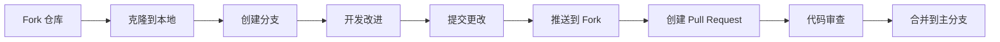

# 贡献指南

<div align="center">


</div>

## 💡 如何贡献

非常感谢您对物理可视化项目的关注！我们欢迎各种形式的贡献，包括但不限于：

- 🐛 报告问题和错误
- 💻 提交代码改进
- 📝 完善文档
- 🎨 优化用户界面
- 🌐 本地化和国际化
- ✨ 提出新功能建议

无论您是开发者、设计师、教育工作者还是物理爱好者，您的贡献都将帮助我们打造更好的物理教育工具。

## 🚀 贡献流程

### 1. 准备工作

在开始贡献之前，请确保您已经：

- 熟悉 [GitHub 工作流程](https://guides.github.com/introduction/flow/)
- 阅读项目的 [README.md](./README.md) 文件
- 安装并配置好开发环境

### 2. 寻找任务

您可以通过以下方式找到需要帮助的任务：

- 查看 [Issues](https://github.com/yourusername/physics-visualization/issues) 页面中标记为 `help wanted` 或 `good first issue` 的问题
- 在使用过程中发现并报告新问题
- 根据您的专业领域提出改进建议

### 3. 开发流程



详细步骤如下：

1. Fork 本仓库到您的 GitHub 账户
2. 将 Fork 后的仓库克隆到本地
   ```bash
   git clone https://github.com/您的用户名/physics-visualization.git
   cd physics-visualization
   ```

3. 创建一个新的分支，分支名应该能描述您的更改
   ```bash
   git checkout -b feature/您的特性名称
   # 或者
   git checkout -b fix/您要修复的问题
   ```

4. 进行开发工作，实现您的改进
5. 提交您的更改，使用清晰的提交信息
   ```bash
   git add .
   git commit -m "描述: 您做了什么更改以及为什么"
   ```

6. 将您的更改推送到 GitHub
   ```bash
   git push origin feature/您的特性名称
   ```

7. 在 GitHub 上创建 Pull Request

### 4. 代码规范

为保持代码库的一致性和可维护性，请遵循以下规范：

- **JavaScript/TypeScript**: 遵循 [Airbnb JavaScript 风格指南](https://github.com/airbnb/javascript)
- **Vue**: 遵循 [Vue 风格指南](https://cn.vuejs.org/style-guide/)
- **Git**: 提交信息应清晰、简洁且描述性强
- **测试**: 为新功能编写测试，确保现有测试通过

### 5. 代码审查

所有提交的 Pull Request 都会经过代码审查。在审查过程中：

- 保持开放的心态，接受反馈
- 及时回应审查者的评论
- 根据需要更新您的代码

## 📋 报告问题

如果您在使用过程中发现问题，请通过 GitHub Issues 报告。提交问题时，请包含：

- 清晰的问题描述
- 复现步骤
- 预期行为与实际行为
- 截图或错误日志（如适用）
- 环境信息（浏览器版本、操作系统等）

## 💬 沟通渠道

有任何问题或建议，您可以通过以下方式与我们联系：

- GitHub Issues
- 项目讨论区
- 邮件联系（待添加）

## 🙏 致谢

感谢所有贡献者对本项目的支持！您的参与使这个项目更加完善。

---

<div align="center">
  <sub>每一份贡献都是珍贵的 ✨</sub>
</div> 